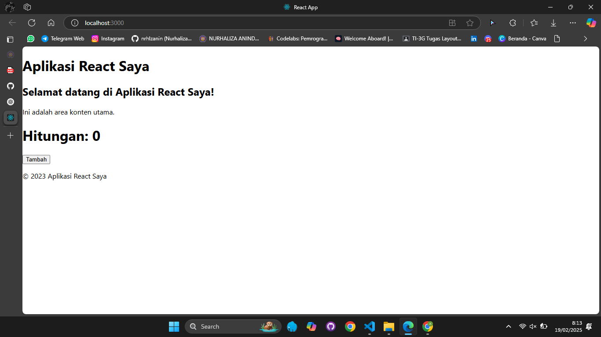

This is a [Next.js](https://nextjs.org/) project bootstrapped with [`create-next-app`](https://github.com/vercel/next.js/tree/canary/packages/create-next-app).

## Getting Started

First, run the development server:

```bash
npm run dev
# or
yarn dev
# or
pnpm dev
# or
bun dev
```

Open [http://localhost:3000](http://localhost:3000) with your browser to see the result.

You can start editing the page by modifying `app/page.tsx`. The page auto-updates as you edit the file.

This project uses [`next/font`](https://nextjs.org/docs/basic-features/font-optimization) to automatically optimize and load Inter, a custom Google Font.

## Laporan Praktikum

|  | Pemrograman Berbasis Framework 2025 |
|--|--|
| NIM |  2241720016|
| Nama |  Nurhaliza Anindya Putri |
| Kelas | TI - 3D |


##  Langkah-langkah Praktikum 
### Persiapan Lingkungan

1. Pastikan Node.js dan npm sudah terinstal di komputer Anda. Anda dapat memeriksanya dengan menjalankan perintah berikut di terminal atau command prompt: 
```bash 
node -v
npm -v
```
2. Buat direktori baru untuk proyek React Anda: 
```bash 
mkdir praktikum-react
cd praktikum-react
```
3. Inisialisasi proyek React dengan menjalankan perintah berikut: 
```bash 
npx create-react-app my-react-app
cd my-react-app
```
4. Jalankan aplikasi React dengan perintah: 
```bash 
npm start
```
Aplikasi akan terbuka di browser pada alamat http://localhost:3000. 

> 
> 
> Berhasil melaukan pembuatan aplikasi react secara lokal dan membuka di browser

### Membuat Komponen React 
1. Buka file src/App.js di text editor Anda. 
2. Ganti kode di dalamnya dengan kode berikut untuk membuat komponen sederhana: 
```bash
import React from 'react';

// Komponen Header
function Header() {
  return (
    <header>
      <h1>Aplikasi React Saya</h1>
    </header>
  );
}

// Komponen Main
function Main() {
  return (
    <main>
      <h2>Selamat datang di Aplikasi React Saya!</h2>
      <p>Ini adalah area konten utama.</p>
    </main>
  );
}

// Komponen Footer
function Footer() {
  return (
    <footer>
      <p>&copy; 2023 Aplikasi React Saya</p>
    </footer>
  );
}

// Komponen Utama
function App() {
  return (
    <div>
      <Header />
      <Main />
      <Footer />
    </div>
  );
}

export default App;

```
3. Simpan file dan lihat perubahan di browser. Anda akan melihat tampilan sederhana dengan header, konten utama, dan footer. 

> 
> 
> Berhasil membuat tampilan sederhana dengan header

### Menggunakan JSX untuk Membuat Komponen Dinamis 
1. Buat file baru di direktori src dengan nama Counter.js. 
2. Tambahkan kode berikut untuk membuat komponen Counter yang dinamis: 
```bash
import React, { useState } from 'react';

function Counter() {
  const [count, setCount] = useState(0);

  function handleClick() {
    setCount(count + 1);
  }

  return (
    <div>
      <h1>Hitungan: {count}</h1>
      <button onClick={handleClick}>Tambah</button>
    </div>
  );
}

export default Counter;

```
3. Buka file src/App.js dan impor komponen Counter: 
```bash
import Counter from './Counter';
```
4. Tambahkan komponen Counter ke dalam komponen App: 
```bash
function App() {
  return (
    <div>
      <Header />
      <Main />
      <Counter />
      <Footer />
    </div>
  );
}

```
5. Simpan file dan lihat perubahan di browser. Anda akan melihat tombol "Tambah" yang dapat meningkatkan hitungan saat diklik. 

> 
> 
> Berhasil menambahkan tombol yang dapat meningkatkan gitungan saat di klik

### Menggunakan Props untuk Mengirim Data 
1. Buat file baru di direktori src dengan nama Greeting.js. 
2. Tambahkan kode berikut untuk membuat komponen Greeting yang menerima props: 
```bash
import React, { useState } from 'react';

function Greeting(props) {
    return <h1>Halo, {props.name}</h1>;
}

export default Greeting;

```
3. Buka file src/App.js dan impor komponen Greeting: 
```bash
import Greeting from './Greeting';

```
4. Tambahkan komponen Greeting ke dalam komponen App dan kirim props name: 
```bash
function App() {
  return (
    <div>
      <Header />
      <Main />
      <Greeting name="Nindy" />
      <Counter />
      <Footer />
    </div>
  );
}

```
5. Simpan file dan lihat perubahan di browser. Anda akan melihat pesan "Halo, John!" yang 
ditampilkan oleh komponen Greeting. 

> 
> 
> Berhasil melaukan pengiriman data dengan props

### Menggunakan State untuk Mengelola Data 
1. Buka file src/App.js dan tambahkan kode berikut untuk membuat komponen yang mengelola state: 
```bash 
import React, {useState} from 'react';

function Example() {
  const [name, setName] = useState("");
  const [age, setAge] = useState(0);
  const [email, setEmail] = useState("");

  const handleNameChange = (e) => {
    setName(e.target.value);
  };

  const handleAgeChange = (e) => {
    setAge(e.target.value);
  };

  const handleEmailChange = (e) => {
    setEmail(e.target.value);
  };

  return (
    <div>
      <input
        type="text"
        placeholder="Nama"
        value={name}
        onChange={handleNameChange}
      />
      <input
        type="number"
        placeholder="Umur"
        value={age}
        onChange={handleAgeChange}
      />
      <input
        type="email"
        placeholder="Email"
        value={email}
        onChange={handleEmailChange}
      />
      <p>
        {name} berumur {age} tahun dan emailnya adalah {email}.
      </p>
    </div>
  );
}
```
2. Tambahkan komponen Example ke dalam komponen App: 
```bash 
function App() {
  return (
    <div>
      <Header />
      <Main />
      <Greeting name="Nindy" />
      <Counter />
      <Example />
      <Footer />
    </div>
  );
}

```
3. Simpan file dan lihat perubahan di browser. Anda akan melihat form input yang dapat mengupdate state dan menampilkan data yang dimasukkan. 

> 
> 
> Berhasil melaukan pembuatan form input yang dapat mengupdate state dan menampilkan data yang dimasukkan

## Tugas 
1. Buat komponen baru bernama TodoList yang menampilkan daftar tugas (todo list). Gunakan state untuk mengelola daftar tugas dan props untuk mengirim data tugas ke komponen anak. 
2. Tambahkan fitur untuk menambahkan tugas baru ke dalam daftar menggunakan form input. 
3. Implementasikan fitur untuk menghapus tugas dari daftar. 

> 
> 
> Berhasil membuat todo list yang menampilkan daftar tugas yang bisa ditambahkan dan dihapus
